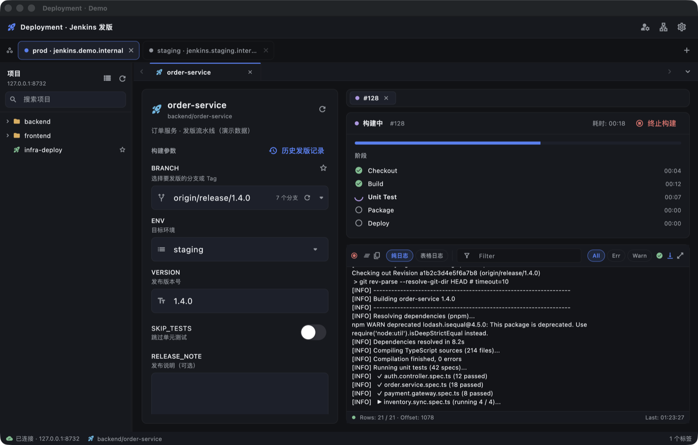
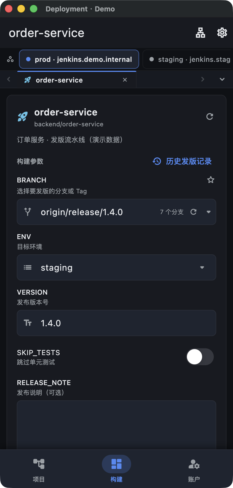
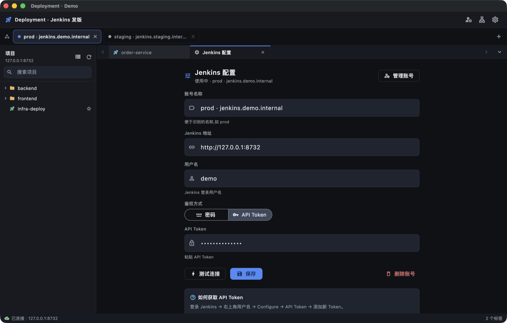

# Deployment Browser

**Deployment Browser** 是一个开源的 **Flutter 跨平台桌面 + 移动应用**，用于在 **多标签工作区** 中集中管理 **Jenkins 发版**：浏览项目树、配置分支与构建参数、一键触发构建，并 **实时** 展示队列状态、阶段进度（Pipeline Stage View）与控制台日志。

**作者 & 维护者：** **Guo's**

**仓库：** [github.com/iGuos/Deployment-Browser](https://github.com/iGuos/Deployment-Browser)

简体中文 | English（待补充）

> 解决 Jenkins Web 页面发版繁琐的痛点：在多标签工作区里集中管理项目，一次性配好分支与参数，一键 Build Now，实时看进度与日志；一套代码同时跑 macOS / Windows / Linux 桌面与 iOS / Android 移动端。
>
> UI 风格借鉴 IDE 多标签 + 深色为主、浅色可选的设计语言。

---

## 截图

> 以下截图均为**演示数据**（本地 mock，见 [tool/demo/](tool/demo/)），不含任何真实 Jenkins 信息。

<p align="center">
  
</p>

<p align="center"><em>桌面主界面：顶部多账号标签栏，左侧项目树，中间分支选择与参数表单，右侧实时发版进度（Pipeline 阶段图标：Checkout / Build 已完成、Unit Test 进行中）与控制台日志。</em></p>

<p align="center">
  
</p>

<p align="center"><em>移动端（窄屏布局）：AppBar + 分支/参数表单 + 实时进度与日志，底部 BottomNav 在项目 / 构建 / 账户间切换。</em></p>

<p align="center">
  
</p>

<p align="center"><em>设置页：Jenkins 地址 / 鉴权方式（Token / 密码）配置、测试连接、主题与语言、内置网络代理入口。</em></p>

---

## 界面布局

**桌面（≥ 1100px）**

```text
┌─────────────────────────────────────────────────────────────┐
│ 应用标题栏 · 主题切换                                          │
├─────────────────────────────────────────────────────────────┤
│ [首页] [order-service] [+]                  ← chrome 标签栏    │
├──────────┬──────────────────────────────────────────────────┤
│  项目树   │  ┌──────────────┐ ┌─────────────────────────┐    │
│          │  │ 分支选择器     │ │  发版进度面板             │    │
│ ● 后端组  │  │ 参数表单       │ │  ▓▓▓▓░░  Build #128      │    │
│ ● 前端组  │  │ [立即构建]     │ │  ✓ Checkout              │    │
│          │  └──────────────┘ │  ◐ Test (running)        │    │
│          │                   │  ○ Deploy                │    │
│          │                   ├─────────────────────────┤    │
│          │                   │  实时日志（progressiveText）│    │
├──────────┴──────────────────────────────────────────────────┤
│ 状态栏：● 已连接 jenkins.example.com · 3 tabs                  │
└─────────────────────────────────────────────────────────────┘
```

**移动（< 720px）** — AppBar + 表单 + 进度 + BottomNav（构建 / 项目 / 设置）三段式响应式布局。

---

## 核心特性

- **多账号 Jenkins 配置**：URL + 用户名 + Token / 密码二选一；测试连接；本地凭证走 **系统钥匙串**（`flutter_secure_storage`）。支持多实例并存、命名切换。
- **账号导入导出 / 二维码分享**：批量导出账号 JSON 备份或迁移；通过二维码（`qr_flutter` 生成、`mobile_scanner` 扫描）在设备间快速分享账号。
- **多标签工作区**：Chrome 风格 tab；首页 / 设置 / 项目页可同时打开；状态自动持久化（`shared_preferences`）。
- **项目树**：递归展示 Folder / MultiBranch / Job；按颜色显示最近构建结果；支持搜索过滤与收藏。
- **快速发版**：多分支流水线 → 选择分支；参数化项目 → 动态生成表单；一键 Build Now，并可 **取消运行中的构建**。
- **实时进度与日志**：队列等待、构建进度（基于阶段的进度估算）、Pipeline Stage View 阶段图标（成功 / 失败 / 进行中）；`progressiveText` 增量拉取日志，自动滚动，error / warn 关键字着色。
- **内置网络代理与 HTTPS 解密**：转发代理 + 加密代理链路；动态生成 MITM 根证书用于调试 Jenkins HTTPS；移动端证书信任探测与安装引导。详见 [docs/NETWORK_PROXY_PLUGIN.md](docs/NETWORK_PROXY_PLUGIN.md)。
- **主题与国际化**：深色 / 浅色 / 跟随系统三档切换；简体中文 / English（`flutter_localizations` + `intl` + ARB）。
- **响应式布局**：≥ 1100px 桌面侧边栏 + 标签栏；< 720px 移动 BottomNav。
- **技术栈**：**Flutter 3.x** + **Dart 3.11** + **Riverpod 3** + **dio** + **go_router**。

---

## 环境要求

- **Flutter** ≥ 3.41（stable），**Dart** ≥ 3.11
- 各目标平台额外要求：

  | 平台 | 额外要求 |
  |------|----------|
  | macOS 桌面 | Xcode + CocoaPods |
  | iOS | Xcode + CocoaPods + Apple Developer 证书 |
  | Android | Android Studio + 相应 SDK |
  | Windows | Visual Studio + C++ workload |
  | Linux | clang / cmake / ninja-build / pkg-config / GTK |

先用 `flutter doctor -v` 确认本机至少满足 macOS desktop / Chrome 即可开始。

---

## 快速开始

```bash
git clone https://github.com/iGuos/Deployment-Browser.git
cd Deployment-Browser
flutter pub get
flutter gen-l10n
```

运行（Web 最快）：

```bash
flutter run -d chrome          # Web
flutter run -d macos           # macOS 桌面
flutter run                    # iOS / Android（连接设备 / 模拟器后）
```

静态检查与测试：

```bash
flutter analyze
flutter test
pnpm verify                    # 一键验收：flutter test + dart analyze
```

更多架构说明、Jenkins 对接经验（CSRF、Cookie、Pipeline `json=` 触发等）见 **[docs/DEVELOPMENT.md](docs/DEVELOPMENT.md)**。

---

## Jenkins 凭证

应用以 Basic Auth 形式发送，支持两种鉴权方式：

1. **API Token（推荐）**：Jenkins → 右上角用户名 → **Configure** → **API Token** → 添加新 Token，复制到本应用「凭证」字段。
2. **用户名 + 密码**：直接使用 Jenkins 登录密码（未启用二步验证时）。

> 凭证只保存在 **本机系统钥匙串**（macOS / iOS Keychain、Android Keystore、Windows DPAPI），不会上传任何远程服务。

---

## 内置网络代理与 HTTPS 解密

应用内置转发代理用于移动端或远端设备访问 Jenkins，支持 **加密代理**（代理协议外层 TLS）与 **HTTPS 解密抓包**（服务端动态生成 MITM 根证书与站点证书）。证书与缓存默认保存在本机用户目录：

- macOS：`~/Library/Application Support/Deployment/mitm`
- 其他桌面环境：`~/.deployment/mitm`

这些文件包含私钥和本机根证书，**不能提交到仓库**。开启 HTTPS 解密后，移动端每 15 秒探测代理状态与 MITM 证书信任状态；需信任而未信任时会弹框引导，并打开 `https://<proxy-host>:<proxy-port>/__proxy/cert` 安装页（iOS 需手动安装描述文件并在「证书信任设置」中开启完全信任）。完整说明见 [docs/NETWORK_PROXY_PLUGIN.md](docs/NETWORK_PROXY_PLUGIN.md)。

---

## API 一览

| 用途 | 端点 |
|------|------|
| 测试连接 | `GET /api/json` |
| 节点树 | `GET /api/json?tree=jobs[name,url,_class,...{deeper}]` |
| 项目详情 | `GET /job/{path}/api/json`（解析 `actions[].parameterDefinitions`） |
| 触发构建 | `POST .../buildWithParameters`；Pipeline 常见 fallback：`POST .../build` + 表单字段 `json=`（见开发文档） |
| 取消构建 | `POST /job/{path}/{n}/stop` |
| 队列状态 | `GET /queue/item/{id}/api/json` |
| 构建详情 | `GET /job/{path}/{n}/api/json` |
| 控制台日志 | `GET /job/{path}/{n}/logText/progressiveText?start={N}` |
| Pipeline 阶段 | `GET /job/{path}/{n}/wfapi/describe` |

> `{path}` 自动按 `/job/<seg>` 编码以处理 Folder；多分支流水线下 `分支 = 子 job`，实际触发路径为 `parent/branch`。

---

## 项目结构

```text
lib/
├── main.dart                    # 入口（窗口初始化、ProviderScope）
├── app.dart                     # MaterialApp + 主题
├── core/                        # 跨功能基础设施
│   ├── theme/                   # AppColors + AppTheme + ThemeController
│   ├── responsive/              # 桌面 / 移动断点
│   ├── http/                    # JenkinsHttpClient（Basic Auth + 拦截器 + 代理适配）
│   ├── storage/                 # secureStorage / SharedPreferences
│   ├── locale/                  # 语言控制器
│   └── utils/                   # logger / 时长格式化 / 错误日志
├── features/
│   ├── settings/                # Jenkins 配置、多账号、导入导出、二维码分享、代理设置
│   ├── workspace/               # 多标签工作区（home / sidebar / tab bar / status bar）
│   ├── jenkins/                 # Jenkins API + 项目页 + 参数表单 + 项目树
│   └── release/                 # 发版流程（trigger / progress / log）
├── plug/
│   └── network_proxy/           # 内置 HTTP/HTTPS 代理、MITM 证书、代理状态探测
└── l10n/                        # 国际化（zh / en）
```

---

## 脚本

| 脚本 | 说明 |
|------|------|
| `pnpm dev` | `flutter run -d macos` |
| `pnpm dev:web` | `flutter run -d chrome --web-port=5173` |
| `pnpm analyze` | `flutter analyze` 静态检查 |
| `pnpm test` | `flutter test` 单元 / Widget 测试 |
| `pnpm verify` | `flutter test && dart analyze` 一键验收 |
| `pnpm dist:macos` | 构建 macOS app |
| `pnpm dist:macos:dmg` | 构建 macOS app 并打包 DMG（`scripts/build-macos-dmg.py`） |
| `pnpm dist:windows` | 构建 Windows |
| `pnpm dist:web` | 构建 Web |
| `pnpm dist:ios` | 构建 iOS IPA |
| `pnpm dist:android` | 构建 Android APK |
| `pnpm clean` | `flutter clean` |

构建产物路径：

```bash
flutter build macos      # → build/macos/Build/Products/Release/Deployment.app
flutter build windows    # → build/windows/runner/Release/
flutter build linux      # → build/linux/x64/release/bundle/
flutter build apk        # → build/app/outputs/flutter-apk/app-release.apk
flutter build ipa        # → build/ios/ipa/*.ipa
flutter build web        # → build/web/
```

---

## 安全说明

- 凭证仅存于本机 **系统钥匙串**，不上传任何远程服务。
- MITM 根证书与私钥保存在本机用户目录，且不纳入版本控制；重新生成根证书后旧站点证书缓存自动失效并重建。
- Basic Auth 凭证在请求时即时注入，不持久化到日志或缓存。

---

## 路线图 / TODO

- [ ] 标签拖拽排序持久化
- [ ] 项目页加入「构建历史」面板
- [ ] 桌面端原生通知（构建完成 / 失败）
- [ ] 移动端推送（构建状态变化）
- [ ] 自定义状态栏快捷指标 / 主题色自定义
- [ ] 暗色 Pipeline 阶段流程图（横向卡片视图）
- [ ] GitHub Actions 自动出 Release 包

---

## License

待补充。
